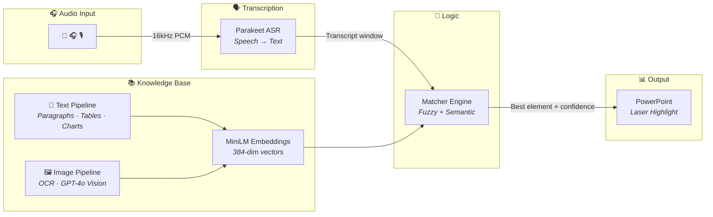
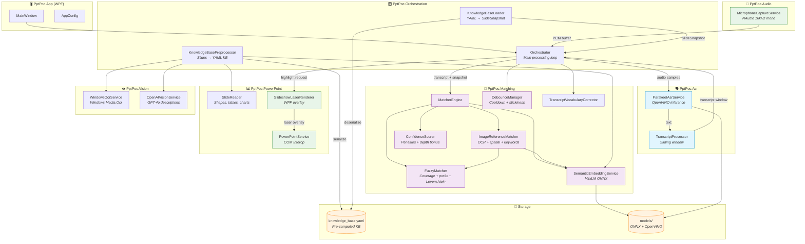
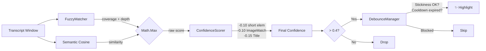

# 🎯 PPT Speaker Highlight — Real-Time Voice-Driven Slide Highlighting

<p align="center">
  
  
  
  
  
</p>

> A proof-of-concept desktop application that **listens to a presenter speaking** and **highlights the corresponding PowerPoint slide element in real-time** — text bullets, chart labels, tables, or images — using fully local AI models (no cloud dependencies).

---

## ⚡ High-Level Architecture



---

## 🎬 How It Works

1. **Listen** — Captures microphone audio in real-time (16kHz, mono)
2. **Transcribe** — Local Parakeet ASR converts speech to text every ~150ms
3. **Match** — Fuzzy + semantic scoring finds the best matching slide element
4. **Highlight** — Draws a laser-pointer overlay on the winning element in PowerPoint

The entire pipeline runs **locally on-device** with ~200ms end-to-end latency.

---

## 🚀 Quick Start

### Prerequisites
- [.NET 8.0 SDK](https://dotnet.microsoft.com/download/dotnet/8.0)
- Microsoft PowerPoint (Office COM Interop)
- Windows 10/11 (x64)

### Run
```powershell
dotnet run --project .\src\PptPoc.App\PptPoc.App.csproj
```

### First Launch
| Step | What happens | Time |
|------|-------------|------|
| 1 | Extracts corporate proxy settings if needed | Instant |
| 2 | Shows Splash Screen while downloading Parakeet ASR model (~200MB) | ~30s |
| 3 | Shows Splash Screen while downloading MiniLM embedding model (~23MB) | ~5s |
| 4 | Compiles OpenVINO inference cache | ~10s |
| 5 | App minimizes to System Tray | Instant |

> Subsequent launches skip downloads and use the compiled cache (~2s startup).

### How to Use
1. Locate the **PPT Highlighting Engine** icon in your Windows System Tray (bottom right).
2. Open your PowerPoint presentation.
3. Right-click the tray icon and select **"Start Engine"**.
4. The system will analyze your active presentation, generate the `knowledge_base.yaml`, and start listening to your microphone!
5. To switch presentations, hit **"Stop Engine"**, open the new presentation, and hit **"Start Engine"** again.

---

## 🎁 Distribution & Deployment

This project is configured to be compiled into a single, self-contained executable that **does not require the .NET SDK to be installed** on the target user's machine.

```powershell
dotnet publish src/PptPoc.App/PptPoc.App.csproj -c Release -r win-x64 --self-contained true -p:PublishSingleFile=true
```
The deployable `.exe` will be located in `src/PptPoc.App/bin/Release/net8.0-windows10.0.17763.0/win-x64/publish/`.

---

## 📦 Project Structure

```
PPT-text-Image-highlight-POC/
├── src/
│   ├── PptPoc.App/              # WPF host, UI, configuration
│   ├── PptPoc.Audio/            # NAudio microphone capture (16kHz PCM)
│   ├── PptPoc.Asr/             # OpenVINO Parakeet speech-to-text
│   ├── PptPoc.Core/            # Shared models, interfaces, config
│   ├── PptPoc.Matching/        # FuzzyMatcher, SemanticEmbedding, ConfidenceScorer
│   ├── PptPoc.Orchestration/   # Main loop, KB preprocessor/loader
│   ├── PptPoc.PowerPoint/      # COM Interop, shape extraction, laser renderer
│   └── PptPoc.Vision/          # Windows OCR, OpenAI Vision (optional)
├── tests/
│   ├── PptPoc.Matching.Tests/
│   └── PptPoc.Orchestration.Tests/
├── models/                      # Auto-downloaded AI models
│   ├── minilm/                  # all-MiniLM-L6-v2 (ONNX, quantized)
│   └── parakeet/               # OpenVINO Parakeet ASR
└── logs/                        # Serilog output (debug + info)
```

---

## 🧠 Implementation Phases

### Phase 1 — Core Pipeline
- **Audio Capture:** Continuous 16kHz PCM via NAudio with configurable buffer sizes
- **ASR Engine:** OpenVINO Parakeet with 3-second overlapping sliding window to prevent word chopping across stateless encoder boundaries
- **PowerPoint Interop:** COM-based shape extraction (Z-order, paragraphs, tables, charts), translucent laser overlay rendering

### Phase 2 — Semantic Intelligence
- **Embeddings:** `all-MiniLM-L6-v2` ONNX model generates 384-dim vectors for all slide text at preprocessing time
- **Dual Scoring:** Cosine similarity (semantic) blended with fuzzy coverage (lexical) — best of both worlds
- **Image Understanding:** Windows OCR extracts text from diagrams/charts; alt-text and proximity text provide additional semantic context
- **Chart/Table Extraction:** COM API access to chart SeriesCollection, category names, and table cell content

### Phase 3 — Real-Time UX Polish
- **Debounce & Stabilization:** Global + per-element cooldowns, sliding-window vote stability filter
- **Stickiness:** Prevents oscillation between elements with similar scores — requires a confidence margin to switch
- **Depth Tiebreaking:** Elements matching more transcript words score proportionally higher (+0.03/word beyond 3, up to +0.15)
- **False Positive Guards:**
  - Short text elements (≤2 words) require fuzzy evidence, not just semantic similarity
  - Single OCR word image matches capped at 0.45 (prevents "accuracy" → image highlight)
  - Title penalty (-0.15) favors denser content elements

### Phase 4 — Hands-Free Enhancements
- **Voice Commands:** 
  - Say `"laser on"` or `"laser off"` to toggle highlighting dynamically (or use the configurable Global Hotkey: `Ctrl+Shift+L`)
  - Say `"next slide"` or `"previous slide"` to advance PowerPoint entirely hands-free!
- **System Tray Agent:** Application runs silently in the background. Right-click the presentation icon in the tray to toggle.
- **Visual Feedback Widget:** A tiny heads-up dot rests unobtrusively on screen:
  - 🔵 **Cyan:** Listening to voice commands / waiting
  - 🟢 **Green:** Laser Highlighting Active
  - 🔴 **Red:** Laser Highlighting Disabled
  - 🟡 **Yellow:** Processing / Initializing Knowledge Base
- **Robust Configuration:** Fine-tune chunk settings, model paths, toggle keys, threshold confidences, and theme colors inside the included `appsettings.json`.
- **Spatial Reasoning:** Bounding-box math resolves "the image on the left/right" without a vision model

### Phase 4 — Knowledge Base Preprocessing
- **Offline Preprocessing:** Slides are analyzed once; embeddings, OCR, and metadata cached to YAML
- **Instant Runtime:** No COM/OCR/GPT needed during presentation — pure matching against pre-computed KB
- **Vocabulary Hints:** KB-derived word lists improve ASR accuracy via transcript correction

---

## ⚙️ Configuration

Key tuning parameters (set in `Orchestrator.cs`):

| Parameter | Value | Purpose |
|-----------|-------|---------|
| `TranscriptWindowSeconds` | 5 | Rolling speech window for matching |
| `HighlightDurationMs` | 2000 | How long laser stays visible |
| `CooldownMs` | 1500 | Per-element re-highlight cooldown |
| `GlobalCooldownMs` | 800 | Min gap between any two highlights |
| `MatchConfidenceThreshold` | 0.4 | Minimum score to trigger highlight |
| `StabilityRequiredCycles` | 1 | Votes needed (×2 for images) |

---

## 🧪 Testing

```powershell
# Unit tests (matching logic)
dotnet test tests\PptPoc.Matching.Tests

# Integration tests (orchestrator)
dotnet test tests\PptPoc.Orchestration.Tests
```

---

## 🏗️ Detailed Architecture



---

## 📊 Scoring Pipeline Detail



---

## 📝 License

Internal POC — not for redistribution.
