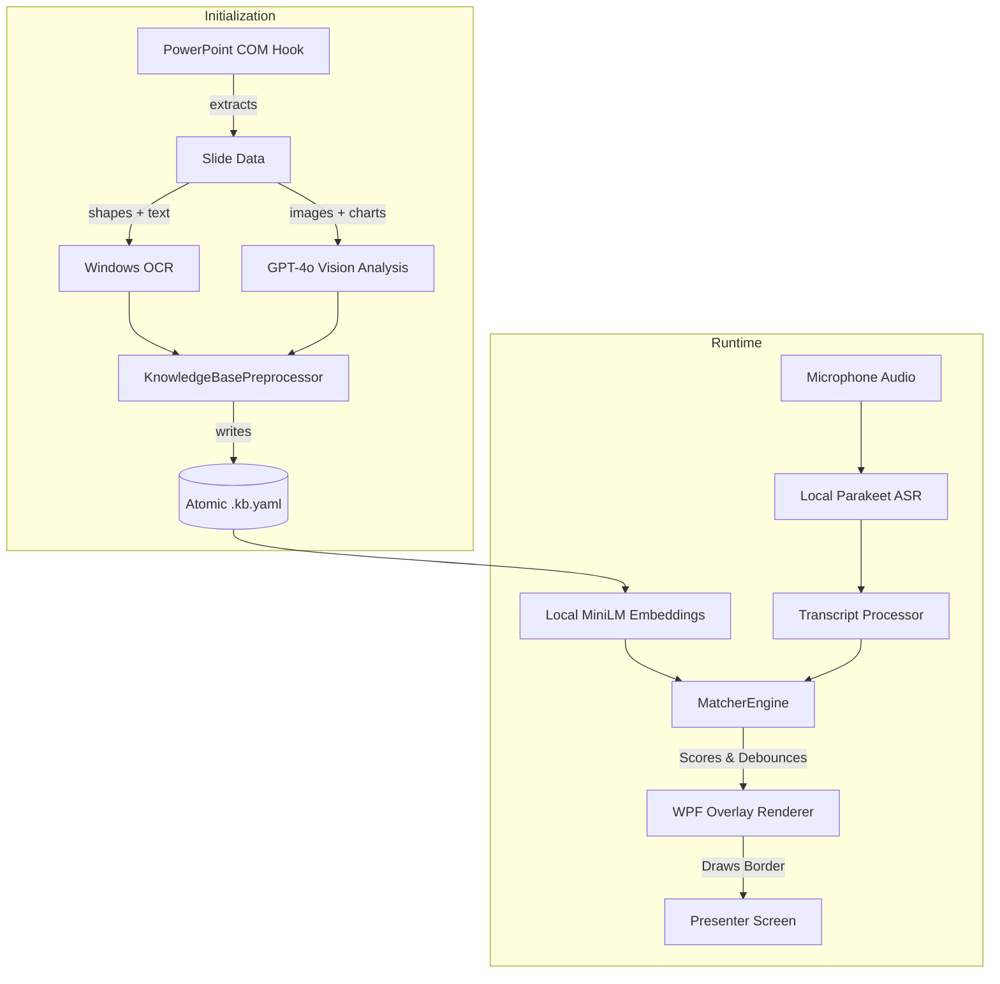

# PowerPoint Voice Highlight Engine

A production-ready C# WPF Voice-Responsive PowerPoint Extension that listens to speech locally and autonomously highlights shapes, charts, sections, data tables, and entities directly inside the active PowerPoint presentation.

It functions as an ambient conversational bridge during executive presentations, automatically casting a 'laser pointer' highlight over the exact diagram, quote, or metric the speaker is verbally referencing.

## 🚀 Quick Start

### Prerequisites
- .NET 8.0 SDK
- Microsoft PowerPoint (Office COM Interop)
- Windows 10/11 (x64)

### Build & Run the Exe
1. Clone the repository.
2. Run `dotnet publish src/PptPoc.App/PptPoc.App.csproj -c Release -r win-x64 --output ./publish`
3. Navigate to the `publish` folder and run `PptPoc.App.exe`.

### First Launch (Background & System Tray)
When running `PptPoc.App.exe` for the first time, the application will initialize seamlessly in the background:
- **No UI Blockers:** The app lives purely in the Windows System Tray (notification area).
- **Model Download Status:** Parakeet AI models and MiniLM Embeddings (~2GB total) will download in the background. A yellow indicator dot signifies it is busy. The app will show a Toast message ("Loading background AI models... Hover over the System Tray icon to view live download progress!").
- **Unified Artifacts:** Models and logs are cleanly isolated in `%LOCALAPPDATA%\Intel_Smart_Presenter_Assistant`.
- **Atomic YAML Caching:** The initialization strictly uses atomic `.tmp` files before overwriting `knowledge_base.yaml`, guaranteeing no corrupted caches if PPT closes midway.

> Subsequent launches skip downloads and use the compiled cache (~2s startup).

### How to Use
1. Locate the **PPT Highlighting Engine** icon in your Windows System Tray (bottom right).
2. Open your PowerPoint presentation. Wait for the engine to automatically preprocess the slide contents (Tray indicator becomes grey).
3. Right-click the tray icon and select **Settings...** to configure Hotkeys or view Active Paths.
4. Begin your presentation (Slide Show Mode) and explicitly say **'Laser ON'** (or use the configured hotkey `Ctrl+Shift+L`) to activate the voice engine. The tray dot will turn **cyan**.
5. The system will start listening to your microphone! As you speak about charts or numbers on the active slide, a yellow/cyan laser highlight will natively track your references.
6. To switch presentations, close PowerPoint and open a new one. The engine gracefully hooks the new COM object automatically. Explicitly say **'Laser OFF'** to manually pause highlighting.

## ⚡ High-Level Architecture

The product is a C# .NET 8 Headless WPF app interfacing with the native Microsoft Office COM API. It combines localized transcription (ASR) with dynamic YAML generation mapped via Windows OCR and GPT-4o Vision to construct spatial coordinate mappings of every slide. 



## 🎥 Core Systems & Engine Capabilities

### 1. Slide Knowledge Compilation (YAML)
On load, the system extracts the full structural DOM of the PPTX file natively via COM interop.
*   **Vision & OCR Extraction:** Images, layout charts, and data tables are rasterized and pushed through Windows OCR and GPT-4o Vision to compute relative pixel coordinates. 
*   **Data Serialization:** Properties such as `chart_numeric_facts`, spatial orientation (`left`, `top`), bounding boxes, ordinal indexes, and canonical names are written to a robust atomic `.kb.yaml` file.

### 2. Multi-Tiered Matching Engine
The system interprets your spoken ASR string and maps it against the slide's active YAML representation.
*   **Temporal Smoothing & Debouncing:** A rolling 2-4 second transcript buffer prevents the laser from snapping erratically on filler words. Consecutive silence dynamically flushes the engine to prevent stale highlights.
*   **Spatial & Ordinal Directives:** The system natively understands instructions like *'the chart on the top right'* or *'the second image'*, resolving complex sibling object geometries dynamically.
*   **Numeric Normalization (Chart Numeric Facts):** Verbally spoken numbers (*'Twelve point five percent'*) are mathematically normalized into floats and snapped against embedded chart facts. 
*   **Semantic Intelligence (MiniLM Embeddings):** For descriptive/conceptual talk, a local fast-embedding cosine similarity pass determines intent without relying entirely on hard string tracking.

### 3. Non-Intrusive Background UI (Win32 Tray)
The application is entirely headless. It avoids blocking UI elements (like MessageBoxes) and utilizes the native Windows Notification Tray.
*   🟡 **Yellow:** Downloading AI Models or Preprocessing PPTX COM.
*   ⚪ **Grey/Idle:** System active, PPT recognized, waiting for 'Laser ON'.
*   🔵 **Cyan:** Microphone hot. Active inference listening for matches.

## 📦 Project Structure

```
src/
├── PptPoc.App/             # Headless WPF & WinForms Tray Entrypoint
├── PptPoc.Orchestration/   # Core event loop, PPT state detection & file locking
├── PptPoc.Matching/        # Confidence Scorers, Spatial/Numeric Resolvers, Embeddings
├── PptPoc.Asr/             # Parakeet Speech-To-Text local module
├── PptPoc.Audio/           # Microphone loop capture
├── PptPoc.Vision/          # Windows OCR & LLM-based image captioning
├── PptPoc.Core/            # Shared Models (SlideElements, RAGContext, configs)
├── PptPoc.PowerPoint/      # SlideReader, COM wrapping, & WPF Highlight Renderer
```

## ⚙️ Configuration (appsettings.json)
Configure deep matching margins or disable models via settings natively. You can safely modify `appsettings.json` and changes like hotkeys or thresholds will reflect dynamically.

| Key | Description | Default |
|-----|-------------|---------|
| `LaserToggleHotkey` | Global hotkey mapping | `Ctrl+Shift+L` |
| `MatchConfidenceThreshold` | Floor heuristic confidence | `0.2` |
| `ActiveVisualHoldDurationMs`| Duration a chart highlight sticks | `8000` |
| `TableHighlightDurationMs` | Duration a tabular fact highlight sticks | `2500` |
| `HighlightColorText` | Color for highlighting text elements | `#FFFF00` (Yellow) |
| `HighlightColorImage` | Color for highlighting image/visual elements | `#00BFFF` (Deep Sky Blue) |
| `HttpProxy` | Optional proxy URL for downloading models (e.g. `http://proxy:911`) | `null` |
| `AudioDeviceIndex` | Maps out specifically which local microphone to capture | `0` |

## 🧪 Testing
Includes Unit test suites targeting algorithmic thresholds:
```powershell
dotnet test .\tests\PptPoc.Matching.Tests\PptPoc.Matching.Tests.csproj
```